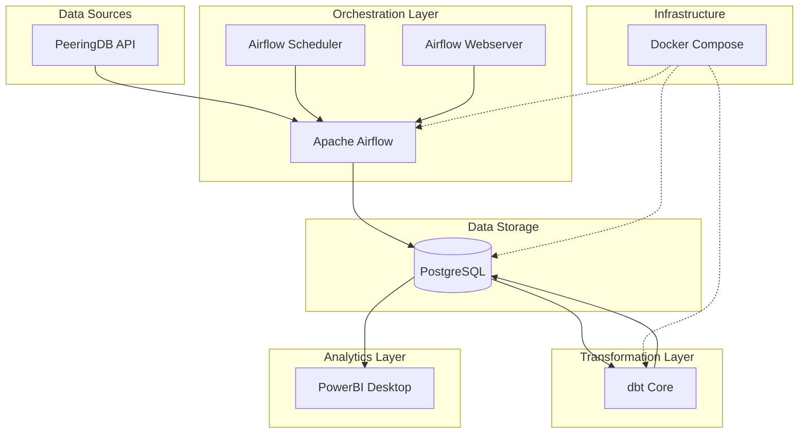

# Architecture Overview

## System Architecture

## Data Flow

1. **Data Ingestion**: Airflow DAGs fetch data from PeeringDB API every 6 hours
2. **Data Storage**: Raw data is stored in PostgreSQL tables
3. **Data Transformation**: dbt models clean, validate, and aggregate the data
4. **Analytics**: PowerBI connects to PostgreSQL to create interactive dashboards
5. **Monitoring**: Airflow provides pipeline monitoring and error handling

## Component Details

### Airflow
- **Scheduler**: Manages DAG execution timing
- **Webserver**: Provides web UI for monitoring
- **DAGs**: Define data ingestion workflows

### PostgreSQL
- **Raw Tables**: Store ingested data from PeeringDB
- **Analytics Schema**: Contains transformed data from dbt

### dbt
- **Staging Models**: Clean and standardize raw data
- **Mart Models**: Create business-ready analytics tables

### PowerBI
- **Dashboards**: Interactive visualizations
- **Data Models**: Connect to PostgreSQL analytics schema
